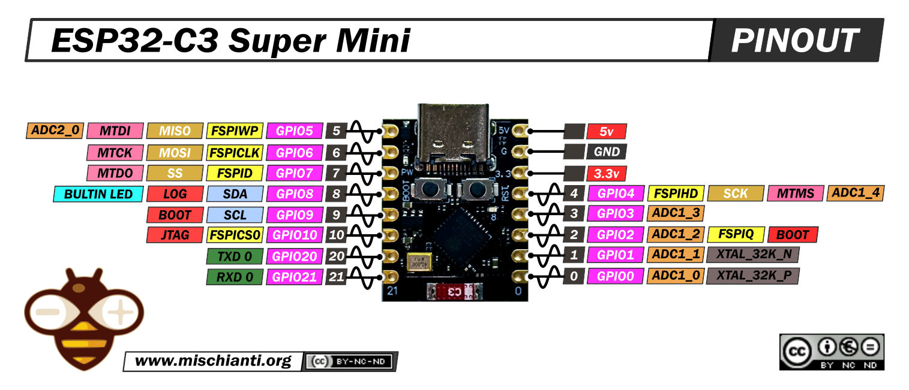

# Apagador Inteligente

## Descripción
Este proyecto es un dispositivo inteligente que permite _apagar y encender un foco_ mediante un **botón** manual, programación de fecha y hora con reloj en tiempo real **DS3231** para encender o apagar un foco. Además de combinar un **encoder** con un **OLED display** para hacer un menú interactivo haciendo un pequeño panel de control y visualizador de fecha y hora. El dispositivo utiliza un microcontrolador **ESP32-C3 Supermini**, bibliotecas para utilizar la pantalla OLED, interactuar con el reloj de tiempo real, programación para interactuar con el encoder y el botón manual.

## Requisitos
- VSCode con extensión Platformio
- ESP32-C3 Supermini
- Push Button
- Encoder
- Pantalla OLED con comunicación I2C
- Diodo LED
- Reloj de tiempo real DS3231
- Resistencia 1K, 220 ohms
- Foco AC
- Activador de foco AC _(Relevador/Relevador de estado solido)_
- Protoboard
- Cables de Conexión

## Pinouts y circuitos



## Instalación
```bash
git init
```

## Uso
Programar eventos de encendido y apagado de uno o varios focos incandescentes mediante distintos métodos como un menú interactivo con la pantalla y encoder, además de cambiar el estado de los focos mediante un botón manual.

## Contribución
Para contribuir en el proyecto vean los vídeos del canal para una mayor comprensión y coloque sus sugerencias en los comentarios del [vídeo de YouTube](https://youtu.be/R2f2gHva5hg?si=1RpnXc-cE9YWpdTS) para tomar en cuenta la mejora. A su vez se es libre de crear un fork del proyecto y hacer sus propias modificaciones. Por favor, mantenga el nombre del autor y el repositorio original en los comentarios de su código.

## Licencia

[MIT](https://choosealicense.com/licenses/mit/)
