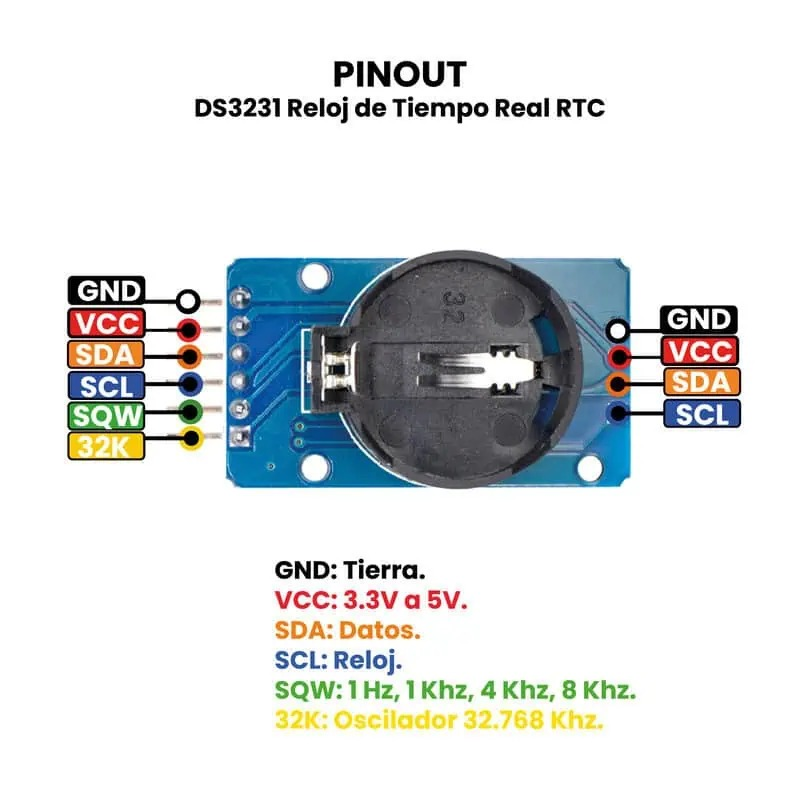
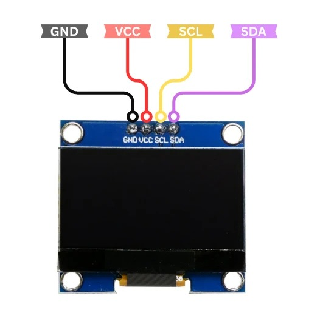

# Apagador Inteligente

## Descripción
En esta rama del proyecto se encuentra la programación necesaria para realizar el menú interactivo con una pantalla I2C y un Encoder. Cuenta con los pines definidos para la **conexión I2C** necesaria para la comunicación con nuestro **reloj en tiempo real** y una **pantalla OLED** y junto al encoder se obtiene un proyecto para interactuar con distintas partes del sistema para mostrar o modificar información.

## Requisitos
- VSCode con extensión Platformio
- ESP32-C3 Supermini
- Encoder
- Pantalla OLED con comunicación I2C
- Diodo LED
- Reloj de tiempo real DS3231
- Resistencia 220 ohms
- Protoboard
- Cables de Conexión

## Pinouts, circuitos y pines
| ESP32-C3 | Descripción | Componente externo

**GPIO9** | PIN_SCL | SCL (OLED) & SCL (RTC)

**GPIO8** | PIN_SDA | SDA (OLED) & SDA (RTC)

**GPIO20** | LED | Resistencia 220 -> GND

**GPIO1** | ENC_SW | Switch Encoder

**GPIO2** | ENC_DT | Pin de datos Encoder

**GPIO3** | ENC_CLK | Pin de reloj Encoder

**Pinout ESP32-C3 Supermini**

    

**Pinout RTC DS3231**

    

**Pinout Display OLED**

    

**Pinout Encoder**

    

## Instalación
Clona el repositorio público en la carpeta en que desees guardarlo para su uso y prueba, una vez terminado el proceso compila el proyecto y cárgalo a tu ESP32 con los pines especificados y los componentes conectados y alimentados (Si tienes otro modelo de ESP32 distinto al del proyecto especifícalo en *"platformio.ini"* y modifica los pines si así lo requieren)

## Uso
Una vez cargado el programa después de unos segundos debe aparecer un menu que se puede recorrer con el mismo encoder y para interactuar se debe presionar como un botón, las opciones del menú son: *Luz Toggle, Fecha y Hora, Modo Prog (Aún sin funcionar), Calendario*.

## Contribución
Para contribuir en el proyecto vean los vídeos del canal para una mayor comprensión y coloque sus sugerencias en los comentarios del [vídeo de YouTube](https://www.youtube.com/watch?v=G7WjDKAGIak) para tomar en cuenta la mejora. A su vez se es libre de crear un fork del proyecto y hacer sus propias modificaciones. Por favor, mantenga el nombre del autor y el repositorio original en los comentarios de su código.

## Enlaces
- [Portafolio](https://github.com/HefestoPrimal/Portafolio)
- [Linkedin](https://www.linkedin.com/in/angel-diaz-mexatronica/)
- [YouTube](https://youtube.com/@mexatronica99)
- [Facebook](https://www.facebook.com/mexatronica99)
- [Instagram](https://www.instagram.com/mexatronica99/)
- [Pinterest](https://mx.pinterest.com/mexatronica99/)
- [TikTok](https://www.tiktok.com/@mexatronica99)

## Autor
Angel D Perez (Mexatrónica)

#### ¡Mucho éxito! :D
___